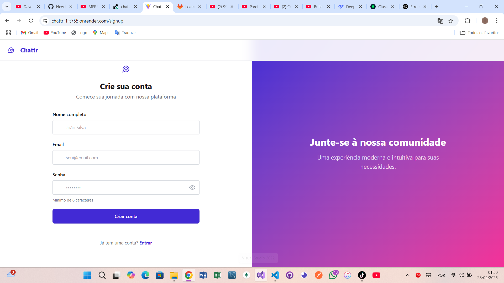
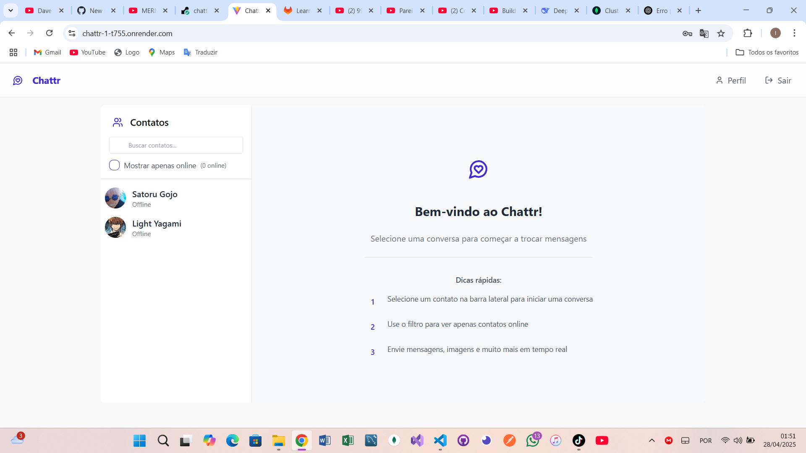
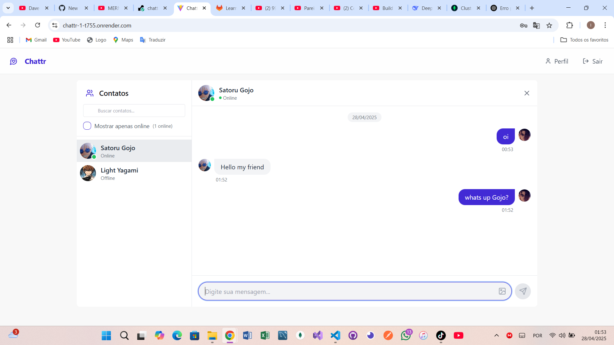

# 💬 Chattr - Chat em Tempo Real

  
Um aplicativo de chat moderno com autenticação e mensagens em tempo real

  
  
  
  

## ✨ Funcionalidades
- 🔒 Autenticação segura com JWT
- 💬 Chat em tempo real via Socket.IO
- 📱 Design responsivo para mobile/desktop
- 📸 Upload de fotos de perfil (Cloudinary)

## 🛠 Stack Tecnológica
**Frontend:**
- React + Vite
- Tailwind CSS + DaisyUI
- Zustand (gerenciamento de estado)
- Axios (requisições HTTP)

**Backend:**
- Node.js + Express
- MongoDB (Mongoose)
- Socket.IO
- JWT + bcryptjs

## 🖼 Screenshots

  <h3>Telas de Autenticação</h3>
  

    
    
  

  <h3>Telas de Conversa</h3>
  

    
    
  

## 🌐 Deploy
O projeto está hospedado no Render:  
🔗 https://chattr-1-t755.onrender.com/login

---

Desenvolvido com ❤️ por Isaias Marcos  
✉️ Contato: ismuandel@gmail.com
